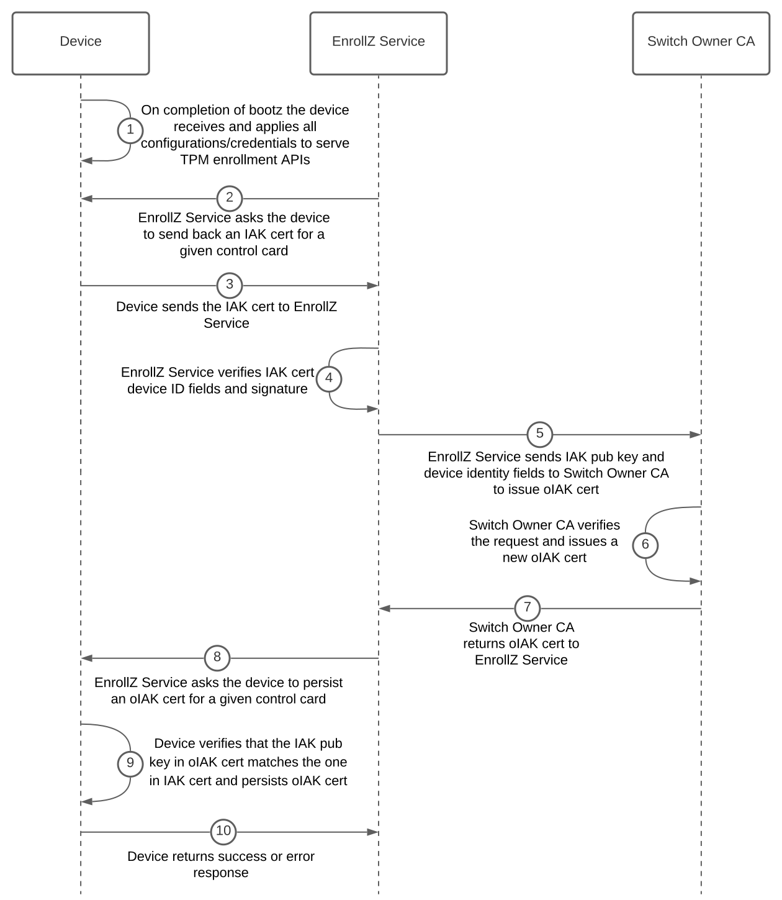
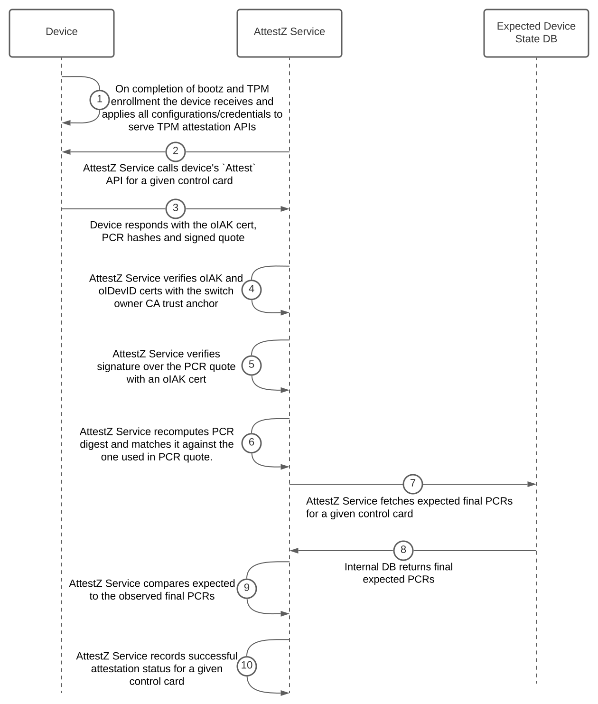

# TPM Enrollment and Attestation of Networking Devices for Device Owners <!-- omit from toc -->

TPM (Trusted Platform Module) enrollment workflow is responsible for cryptographically verifying switches' TPM-rooted identities and provisioning devices with switch owner's attestation certificates.
TPM attestation workflow ensures the integrity of networking devices throughout the entire boot process. The goal of this repository is to specify TPM enrollment and attestation workflow steps, design/APIs, and suggest a corresponding reference implementation of both switch and switch-owner sides of logic.

## Table of Contents <!-- omit from toc -->

- [Terminology](#terminology)
- [TPM 2.0 Enrollment for Switch Owners](#tpm-20-enrollment-for-switch-owners)
  - [TPM 2.0 Enrollment Workflow Steps](#tpm-20-enrollment-workflow-steps)
  - [TPM 2.0 Enrollment Workflow Diagram](#tpm-20-enrollment-workflow-diagram)
  - [TPM 2.0 Enrollment Alternatives Considered](#tpm-20-enrollment-alternatives-considered)
    - [1. EnrollZ service serves TPM enrollment API endpoints](#1-enrollz-service-serves-tpm-enrollment-api-endpoints)
    - [2. Use IAK cert (as is) signed by the switch vendor CA](#2-use-iak-cert-as-is-signed-by-the-switch-vendor-ca)
    - [3. Switch owner uses EK (or EK cert) to issue LAK cert](#3-switch-owner-uses-ek-or-ek-cert-to-issue-lak-cert)
    - [4. Switch owner issues LAK cert based on IAK cert signed by switch vendor CA](#4-switch-owner-issues-lak-cert-based-on-iak-cert-signed-by-switch-vendor-ca)
- [TPM 2.0 Attestation for Switch Owners](#tpm-20-attestation-for-switch-owners)
  - [General Guidelines on What to Attest](#general-guidelines-on-what-to-attest)
  - [Conceptual Flow for *Offline* PCR Precomputation](#conceptual-flow-for-offline-pcr-precomputation)
  - [TPM 2.0 Attestation Workflow Steps](#tpm-20-attestation-workflow-steps)
  - [TPM 2.0 Attestation Workflow Diagram](#tpm-20-attestation-workflow-diagram)
  - [TPM 2.0 Attestation Alternatives Considered](#tpm-20-attestation-alternatives-considered)
- [Switch Owner Prod TLS Cert Issuance](#switch-owner-prod-tls-cert-issuance)
- [RMA Scenario](#rma-scenario)
- [Building](#building)

## Terminology

- [Bootz](https://github.com/openconfig/bootz) is an evolution of [sZTP](https://www.rfc-editor.org/rfc/rfc8572.html).
- TPM EnrollZ service (or simply EnrollZ service) is the switch owner's internal infrastructure service responsible for the TPM 2.0 enrollment workflow.
- TPM AttestZ service (or simply AttestZ service) is switch owner's internal infrastructure service responsible for TPM 2.0 attestation workflow.
- Switch owner CA is the switch owner's internal Certificate Authority service.
- Switch chassis consists of one or more *“control cards”* (or *“control cards”*, *“routing engines”*, *“routing processors”*, etc.), each of which is equipped with its own CPU and TPM. The term control card will be used throughout the doc.

**Differences between various certs** *(more details in the [TCG spec](https://trustedcomputinggroup.org/wp-content/uploads/TPM-2p0-Keys-for-Device-Identity-and-Attestation_v1_r12_pub10082021.pdf))*:

| **Cert type** | **On which pub key is the cert based on?** | **Can there be more than one underlying keypair for a given TPM?** | **Which CA issues/signs the cert?** |
| :---: | :----: | :---: | :---: |
| Initial Attestation Key (IAK) | IAK pub | No | Switch Vendor |
| Local Attestation Key (LAK) | LAK pub | Yes| Switch Owner |
| Owner IAK (oIAK) | IAK pub | No | Switch Owner |
| Endorsement Key (EK) | EK pub | No | TPM Vendor |

## TPM 2.0 Enrollment for Switch Owners

In this workflow switch owner verifies device's Initial Attestation Key (IAK) and Initial DevID (IDevID) certificates (signed by the switch vendor CA) and installs/rotates owner IAK (oIAK) and owner IDevID (oIDevID) certificates (signed by switch owner CA). oIAK and oIDevID certs are based on the same underlying keys as IAK and IDevID certs, respectively, and give switch owner the ability to (1)
fully control certificate structure, revocation and expiration policies and (2) remove external dependency on switch vendor CA during TPM attestation workflow. The assumption is that before the device is shipped to the switch owner, a switch vendor provisions each control card with IAK and IDevID certificates following the TCG specification in
[Section 5.2](https://trustedcomputinggroup.org/wp-content/uploads/TPM-2p0-Keys-for-Device-Identity-and-Attestation_v1_r12_pub10082021.pdf#page=20) and [Section 6.2](https://trustedcomputinggroup.org/wp-content/uploads/TPM-2p0-Keys-for-Device-Identity-and-Attestation_v1_r12_pub10082021.pdf#page=30).

Switch vendors must use one of the follow modes for generating IAK and IDevID keypairs as well as CA signing keys.

- ECC P521 (preferred)
- RSA 4096

### TPM 2.0 Enrollment Workflow Steps

1. On completion of Bootz workflow, device obtains all necessary credentials and configurations to start serving TPM enrollment gRPC API endpoints.
2. On completion of Bootz, EnrollZ service is notified to enroll a TPM on a specific control card and calls the device's `GetIakCert` API to get back an IAK cert.
   - During initial bootstrapping, an active control card must use its IDevID cert for securing TLS connection. Once the device is provisioned with switch-owner-issued prod TLS cert, the device must always use that cert for all subsequent enrollz RPCs (such as `RotateOIakCert`).
   - Primary/active control card is also responsible for all RPCs directed to the secondary/standby control card. The mechanism of internal communication between the two control cards depends on the switch vendor and is out of scope of this doc.
3. EnrollZ service uses the trust bundle/anchor obtained (in advance) from the switch vendor to verify signature over the IAK and IDevID certs, and ensure that the control card serial number in oIAK cert and oIDevID cert is the same.
   - *Note: EnrollZ service must have access to the up-to-date switch vendor trust bundle/anchor needed to verify the signature over the IAK certificate. The mechanics of this workflow are out of scope of this doc, but the trust bundle could be retrieved from a trusted vendor portal on a scheduled basis.*
4. EnrollZ service ensures that device identity fields in IAK cert match its expectations.
5. EnrollZ service asks switch owner CA to issue an oIAK cert based on the IAK pub key and device identity fields.
6. EnrollZ service obtains the oIAK cert from the CA and calls the device's `RotateOIakCert` API to persist the oIAK cert on the control card.
7. The switch verifies that the IAK pub key in oIAK cert matches the one in IAK cert.
8. The switch stores the oIAK cert in non-volatile memory and will present it in the TPM attestation workflow.
9. EnrollZ service repeats the workflow for the second control card if one is available.

**Pros:**

- The approach effectively delegates much of the TPM enrollment workflow to the switch vendor which aligns with the TCG guidance/intention.
- Simplicity of TPM enrollment workflow on switch owner side which should streamline the implementation of the workflow for both switch owner and switch vendors and thus make it easier to onboard new and scale across vendors.
- Using oIAK cert gives switch owner more flexibility and control over the cert structure, management (e.g. revocation) and lifecycle.
- AttestZ service does not have an external dependency on switch vendor CA on every switch attestation.
- Switch vendors do not need to support issuance of LAKs.

**Cons:**

- Need to trust that switch vendors actually performed proper TPM enrollment following TCG spec.

### TPM 2.0 Enrollment Workflow Diagram



### TPM 2.0 Enrollment Alternatives Considered

#### 1. EnrollZ service serves TPM enrollment API endpoints

**Pros:**

- A device knows exactly when it is ready to kick off TPM enrollment workflow (right after Bootz workflow and potential subsequent reboot are complete) whereas in the proposed workflow EnrollZ service will likely need to repeatedly try to reach out to the device until it is ready for TPM enrollment.
- Can be achieved with a single `ExchangeIakCert` API: given an IAK cert return an oIAK cert.

**Cons:**

- From a security standpoint, switches generally should not be initiating connections.
- The design will be cleaner if TPM enrollment followed the same pattern as TPM attestation and gNxI APIs where the device serves the endpoints.

#### 2. Use IAK cert (as is) signed by the switch vendor CA

The workflow would follow the TCG specification documented in [section 5.1](https://trustedcomputinggroup.org/wp-content/uploads/TPM-2p0-Keys-for-Device-Identity-and-Attestation_v1_r12_pub10082021.pdf#page=19) and [section 6.1](https://trustedcomputinggroup.org/wp-content/uploads/TPM-2p0-Keys-for-Device-Identity-and-Attestation_v1_r12_pub10082021.pdf#page=27).

**Pros:**

- Simplifies the workflow and practically removes the TPM enrollment workflow on the switch owner side.

**Cons:**

- Introduces a strong runtime dependency on switch vendor CA every time AttestZ service performs TPM attestation.
- Using a switch-vendor-issued IAK cert gives the switch owner no control over the cert structure, management (e.g. revocation) and lifecycle.
- Need to trust that the switch vendor actually performed proper TPM enrollment following TCG spec.

#### 3. Switch owner uses EK (or EK cert) to issue LAK cert

The workflow would follow the TCG specification documented in [section 5.6](https://trustedcomputinggroup.org/wp-content/uploads/TPM-2p0-Keys-for-Device-Identity-and-Attestation_v1_r12_pub10082021.pdf#page=24) and [section 6.6](https://trustedcomputinggroup.org/wp-content/uploads/TPM-2p0-Keys-for-Device-Identity-and-Attestation_v1_r12_pub10082021.pdf#page=34). In this case the switch vendor would
not perform TPM enrollment at all.

**Pros:**

- Using LAK gives switch owners more flexibility and control over the cert structure, management (e.g. revocation) and lifecycle.
- No need to trust that the switch vendor actually performed proper TPM enrollment following TCG spec.
- Switch vendors do not need to do TPM enrollment and provision the switch with an IAK.
- AttestZ service does not have an external dependency on switch vendor CA on every switch attestation.

**Cons:**

- Switch owner has to develop and support complex TPM enrollment logic that verifies that the device indeed possesses EK private key.
- Either (1) all switch vendors have to publish EK pub on their portal and switch owner to build an automatic system (for each vendor) to fetch and persist it in advance of device shipment or (2) switch owner to obtain and manage a TPM manufacturer trust bundle to verify EK cert with which all switches must be provisioned.
- Switch vendors need to support issuance of LAKs.
- LAKs are also primarily used in scenarios where device/user privacy is important. In the case of network switches (especially the ones running in switch owner's own data centers), however, infra components would actually want to know exactly the identities of the switches, so their privacy is not desirable. Consult
[section 11](https://trustedcomputinggroup.org/wp-content/uploads/TPM-2p0-Keys-for-Device-Identity-and-Attestation_v1_r12_pub10082021.pdf#page=64) of the TCG spec for more details.

#### 4. Switch owner issues LAK cert based on IAK cert signed by switch vendor CA

The workflow would follow the TCG specification documented in [section 5.3](https://trustedcomputinggroup.org/wp-content/uploads/TPM-2p0-Keys-for-Device-Identity-and-Attestation_v1_r12_pub10082021.pdf#page=21) and [section 6.3](https://trustedcomputinggroup.org/wp-content/uploads/TPM-2p0-Keys-for-Device-Identity-and-Attestation_v1_r12_pub10082021.pdf#page=32).

**Pros:**

- Using LAK gives switch owners more flexibility and control over the cert structure, management (e.g. revocation) and lifecycle.
- AttestZ service (a performance-critical service) does not have an external dependency on switch vendor CA on every switch attestation.

**Cons:**

- Need to trust that the switch vendor actually performed proper TPM enrollment following TCG spec.
- The most expensive approach in terms of software development/maintenance perspective as both switch vendors and switch owners will need to engineer complex TPM enrollment logic (see TCG spec for more details).
- Switch vendors need to support issuance of LAKs.
- LAKs are also primarily used in scenarios where device/user privacy is important. In the case of network switches (especially the ones running in switch owner's own data centers), however, infra components would actually want to know exactly the identities of the switches, so their privacy is not desirable. Consult
[section 11](https://trustedcomputinggroup.org/wp-content/uploads/TPM-2p0-Keys-for-Device-Identity-and-Attestation_v1_r12_pub10082021.pdf#page=64) of the TCG spec for more details.

## TPM 2.0 Attestation for Switch Owners

In this workflow switch owner verifies that the device's end-to-end boot state (bootloader, OS, secure boot policy, etc.) matches owner's expectations. This approach assumes that expected final PCR values were precomputed beforehand and are available during the attestation workflow. Thus, on a high level for each control card AttestZ service will (1) fetch final observed PCR values, PCR quote
(signed with IAK private key) and oIAK cert from the device, (2) verify oIAK cert, (3) verify PCR quote signature with oIAK cert, (4) verify PCRs digest, (5) compare observed PCR final values to the expected ones.

### General Guidelines on What to Attest

This section is out of scope of the broader openconfig initiative and instead serves more as a guideline. The general question one should ask when thinking of what to attest is "does changing X on the device change the fundamental boot posture of the device?".
If the answer is yes, then attest it, otherwise it is not required. Examples of such software that should be attested are bootloader image, OS image and secure boot policy.

Similarly, TCG discourages attesting device-specific configurations/software or things that may change after a reboot. In section [3.3.4.2](https://trustedcomputinggroup.org/wp-content/uploads/TCG_PCClient_PFP_r1p05_v23_pub.pdf#page=40) and 3.3.4.4 for PCR [1] and PCR[3] (both of which measure configuration related data) TCG spec states:
*"Entities that MUST NOT be measured as part of the above measurements: System-unique information such as asset, serial numbers, etc., as they would prevent sealing to PCR[3] with a common configuration in a fleet of devices"* and *"The event data MUST not vary across boot cycles if the set of potential PCR[1] measurements measured does not vary"*.
Instead of attesting such configurations, it should be software's (e.g. OS or application layer) responsibility to verify/validate such configs, while the switch owner may attest the underlying software image containing the verification logic.

Attesting secrets is an anti-pattern. Even if one is attesting password *hashes* and even if a hash has strong entropy, it is still a good practice to avoid attesting secrets or potentially-secrets-revealing data.
This is mainly because all the attestable measurements are considered to be public and are logged in plain into the bootlog, which is intended (although not required) to be publicly shared during attestation.

Finally, although the exact PCR allocation may vary across vendors, the expectation is that switch vendors will follow standardized [TCG guidance](https://trustedcomputinggroup.org/wp-content/uploads/TCG_PCClient_PFP_r1p05_v23_pub.pdf#page=36) (which measurements are measured in which PCRs, who makes those measurements, the order of measurements, etc.) for these measurements:

| **PCR Index** | **PCR Usage** |
| :--- | :---- |
| 0 | SRTM, BIOS, Host Platform Extensions, Embedded Option ROMs and PI Drivers |
| 1 | Host Platform Configuration |
| 2 | UEFI driver and application Code |
| 3 | UEFI driver and application Configuration and Data |
| 4 | UEFI Boot Manager Code (usually the MBR) and Boot Attempts |
| 5 | Boot Manager Code Configuration and Data (for use by the Boot Manager Code) and GPT/Partition Table |
| 6 | Host Platform Manufacturer Specific |
| 7 | Secure Boot Policy |
| 8-15 | Defined for use by the Static OS |
| 16 | Debug |
| 23 | Application Support |

### Conceptual Flow for *Offline* PCR Precomputation

The idea is that before devices are even shipped to a switch owner, switch vendors give switch owners (through an API endpoint) final expected PCR values for those PCRs that are the same across all devices for a given product model and bootloader/OS version (PCRs that do not change between reboots and are not device-specific). Such PCR values can include measurements of BIOS image, bootloader
image, OS image, security boot policy, etc. A switch owner would simply
ingest these values and persist them in an internal DB, so that later when AttestZ service actually performs attestation, it can just compare final expected PCRs to the actual PCRs reported by the device, instead of recomputing these PCRs from the boot log for every attestation.

### TPM 2.0 Attestation Workflow Steps

1. Device serves gRPC TPM 2.0 attestation APIs. At this point the device must be booted with the correct OS image and with correct configurations/credentials applied.
   - Primary/active control card is also responsible for all RPCs directed to the secondary/standby control card. The mechanism of internal communication between the two control cards depends on the switch vendor and is out of scope of this doc.
   - Device uses active control card’s IDevID private key and oIDevID cert for securing TLS for the **initial** attestation RPCs. On successful completion of initial attestation, the device will be provisioned with switch owner’s prod credentials/certs and will rely on those for securing TLS in subsequent attestation workflows.
     - *Note: Although this is something that will be assessed on a case by case basis with each switch vendor individually, it may be acceptable to temporarily rely on TLS certs issued by switch owner during Bootz instead of a DevID cert. The preferred temporary approach is for underlying credentials to be issued by the device using a CSR-style request.
     Alternatively (less preferred), Bootz service may generate both the asymmetric key pair and the TLS cert, and deliver them to the device during Bootz. In either case the TLS cert must be short-lived and limited-power (can only be used for TPM enrollment and initial attestation).*
2. AttestZ service calls device’s `Attest` endpoint for a given control card (and a random nonce) to get back:
   - An oIAK cert (received by the device during the TPM enrollment workflow) signed by the switch owner’s CA.
   - Final observed PCR hashes/values.
   - PCR Quote structure and signature over it signed by IAK private key.
   - (Optional - only when the call is intended for the standby control card) oIDevID cert of the standby control card.
3. AttestZ service uses the trust bundle/anchor from switch owner CA to verify oIAK cert and its validity/revocations status.
4. AttestZ service verifies that the control card serial number in oIAK cert and oIDevID cert is the same.
5. AttestZ service uses oIAK cert to verify signature over device’s PCR quotes.
6. AttestZ service recomputes PCR digest and matches it against the one used in PCR quote.
7. AttestZ service fetches expected final PCR values from its DB and compares those to the observed ones reported by the device.
8. AttestZ service records a successful attestation status for a given control card and repeats the workflow for the secondary/standby control card if one is available.

**Pros:**

- No dependency on device boot log that needs to be standardized across all switch vendors.
- Attestation logic is simple as it boils down to just comparing final PCR hashes and does not involve PCR recomputation from the boot log.
- Expected final PCR values are computed only once, for all devices and offline (before devices arrive to switch owners as opposed to on every attestation while switches are already serving production traffic). This is both efficiency and reliability gain.
- The design can be extended to attest device-specific PCRs if needed. In this case switch vendors will also provide (along with final expected PCRs) a structured vendor-agnostic PCR measurement manifest object which describes how to calculate final PCRs and at the very least specifies (1) what measurements go into which PCR, (2) the order of measurements, (3) cryptographic hash algorithm used.
  - *Note: For the actual manifest structure definition, we should consider getting ideas from the [attestation log-retrieval API](https://datatracker.ietf.org/doc/pdf/draft-ietf-rats-yang-tpm-charra-21#page=6) by IETF ChaRRA and re-using/expanding the design from the [Reference Integrity Manifest](https://trustedcomputinggroup.org/wp-content/uploads/TCG_RIM_Model_v1p01_r0p16_pub.pdf) by TCG.
  The goal is for a switch owner, given a vendor-agnostic PCR measurement manifest (the API/object/format definition is vendor-agnostic, but the actual instance of that object is vendor-specific) and PCR measurement inputs (e.g. boot configuration), to have the ability to pre-calculate the expected final PCRs for a given device using standard TPM folding hash technique. For example:*

      ```text
      PCR[5]  ← 0
      PCR[5]  ← Hash(PCR[5] || sha-256(“config-Y”))
      PCR[5]  ← Hash(PCR[5] || sha-256(“config-Z”))
      ```

**Cons:**

- Pre-computation approach deviates from the general TCG specification and IETF ChaRRA draft.

Once the attestation workflow is complete for both control cards, AttestZ service will provision the device with mTLS credentials/certs. Although this workflow is out of scope of this doc, on a high level it may look like this:

1. AttestZ service completes attestation workflow for all switch chassis control cards.
2. AttestZ service asks the device to generate and send back a standard signed OpenSSL Certificate Signing Request (CSR) for issuance of the mTLS credential/cert.
   - *Note: in future, we can further improve the security posture of switches by sealing the private key to the TPM state. This would ensure that a device (1) has to have certain PCR final values to be able to access (unseal) the credential and (2) that only the intended device/control card can access the credential.*
3. AttestZ service verifies CSR and sends the request to issue a mTLS cert to switch owner CA.
4. AttestZ service calls the device to persist the mTLS cert.
5. The device ensures that the cert pub key matches the one it created earlier and persists the cert in non-volatile memory.

### TPM 2.0 Attestation Workflow Diagram



### TPM 2.0 Attestation Alternatives Considered

Before the device is shipped to the switch owner, the switch owner fetches individual PCR measurement artifacts such as bootloader image hash and OS image hash from the switch vendor portal and stores those in the internal DB.

Attestation workflow with differences from the proposed approach in **bold**:

1. Device serves gRPC TPM 2.0 attestation APIs. At this point the device must be booted with the correct OS image and with correct configurations/credentials applied.
   - Primary/active control card is also responsible for all RPCs directed to the secondary/standby control card. The mechanism of internal communication between the two control cards depends on the switch vendor and is out of scope of this doc.
   - Device uses active control card’s IDevID private key and oIDevID cert for securing TLS for the initial attestation RPCs. Once the device successfully completes attestation and is provisioned with switch owner’s prod credentials/certs, the device will rely on those for securing TLS in subsequent attestation workflows.
2. AttestZ service calls device’s `Attest` endpoint for a given control card (and a random nonce) to get back *(note: the API can borrow ideas from [log-retrieval](https://datatracker.ietf.org/doc/pdf/draft-ietf-rats-yang-tpm-charra-21#page=5) and [tpm20-challenge-response-attestation](https://datatracker.ietf.org/doc/pdf/draft-ietf-rats-yang-tpm-charra-21#page=4) APIs):*
   - An oIAK cert signed by the switch owner’s CA and received by the device during the TPM enrollment workflow.
   - Final observed PCR hashes.
   - Quote structure and signature over it signed by IAK private.
   - **Boot log**.
   - (Optional - only when the call is intended for the standby control card) oIDevID cert of the standby control card.
3. AttestZ service uses the trust bundle/anchor from switch owner CA to verify oIAK cert and its validity/revocations status.
4. AttestZ service verifies that the control card serial number in oIAK cert and oIDevID cert is the same.
5. AttestZ service uses oIAK cert to verify signature over device’s PCR quotes.
6. AttestZ service recomputes PCR digest and matches it against the one used in PCR quote.
7. **AttestZ service recomputes final PCR values from the boot log and compares those to the PCR values that the device’s TPM reported. If those match, it can trust the boot log.**
8. **AttestZ service fetches the hashes of PCR measurement events (e.g. OS image hash, bootloader image hash, etc.) it is interested in from the device’s boot log.**
9. **AttestZ service fetches expected PCR measurement (bootloader image, OS image) hashes from internal DB and compares those to the ones from the device’s boot log.**
10. AttestZ service records a successful attestation status for a given control card.
11. AttestZ service repeats the workflow for the secondary/standby control card if one is available.

**Pros:**

- Switch owners can adapt to changes in PCR measurements (for example, if there is new artifact measured to a given PCR) on the fly.
- Switch vendors do not need to host an API to give the switch owner PCR measurement manifest with every bootloader/OS release.
  - *Note: this is only valid when attestation of device-specific PCRs is needed.*
- Aligns with the general TCG specification and IETF ChaRRA draft.

**Cons:**

- AttestZ service has a dependency on device boot log that needs to be standardized across all switch vendors.
- Attestation logic becomes more complex as it involves parsing (hopefully vendor-agnostic) boot log and recomputing all PCRs.
- PCR recomputation from the boot log happens in AttestZ service on every attestation when the switches already serve prod traffic. For most (if not all) of the PCRs the recomputed values should be the same for all devices which is also inefficient.
- AttestZ service needs to “know” the measurement events it is looking for in the log or internal DB. This may not scale well if the events are expected to change over time or if they differ between different switch vendors. Most likely this would imply for switch vendors to provide a simpler version of PCR measurement manifest which defeats the purpose of the approach.

## Switch Owner Prod TLS Cert Issuance

Although TLS cert/keys issuance workflow/APIs is outside of the scope of this document, attestz and enrollz require the following handling of private TLS keys for TPM-equipped networking devices. Each control card has its own separate prod TLS key pair and cert that it never shares with the other card.
Each card can perform CSR-style TLS key pair/cert issuance, where TLS pair key is issued by a control card and the private key never leaves a given control card (never shares the key with another card within the same switch chassis either).
Switch owner will always attest a given control card before issuing a new or rotating an existing prod TLS cert.
In other words, **switch-owner-issued production TLS credentials/certs can only be accessible to control cards that have been TPM enrolled and attested by switch owner**. If a standby control card becomes active/primary, it must use its own TLS cert for all connections with switch owner infra.

## RMA Scenario

One benefit of having multiple control cards is a redundancy model where one control card (active) is serving traffic while another card is unavailable. In such a scenario a switch owner would typically want to replace the failed control card, while the active card is still serving traffic (aka hot-swapping).
The newly inserted (standby) card must be TPM enrolled and attested by the switch owner before the card gets access to switch-owner-issued prod TLS cert. Thus, conceptually the RMA workflow would be the following:

1. During the initial device secure install, switch owner TPM enrolls and attests both control cards. One of the cards acts as primary, serving prod traffic. Each control card has its own switch-owner-issued TLS cert.
2. One of the cards fails and a new standby card is inserted, while the active card is serving prod traffic.
3. Active control card conducts an auth handshake with a newly inserted control card.
   1. Active card sends a nonce to the new standby card.
   2. Standby card signs the nonce with its IDevID private key and sends it back along with its IDevID cert.
   3. Active card verifies nonce signature and IDevID cert.
4. Active card notifies switch owner infra that a new control card is inserted.
5. Switch owner initiates enrollz and attestz workflow for the new standby card. Once attestz succeeds, switch owner issues to the standby control card its own TLS credentials/cert.

## Building

`bazel build //proto:*`
