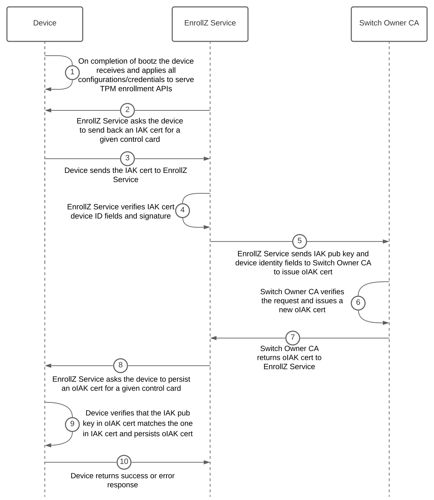
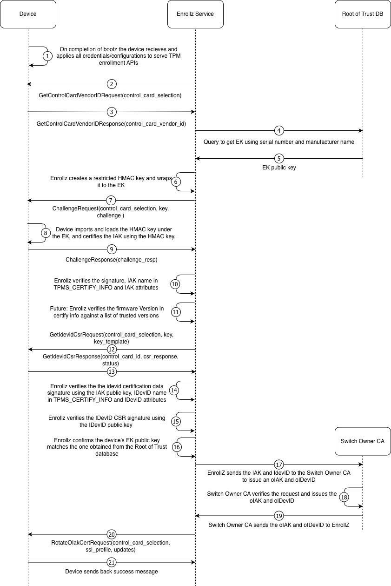
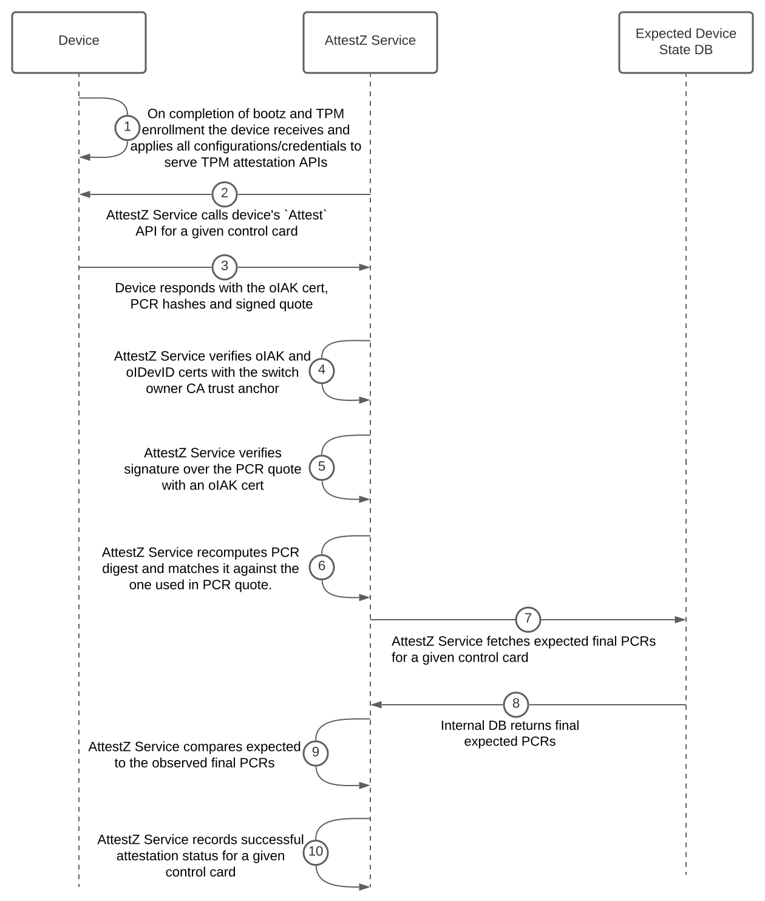
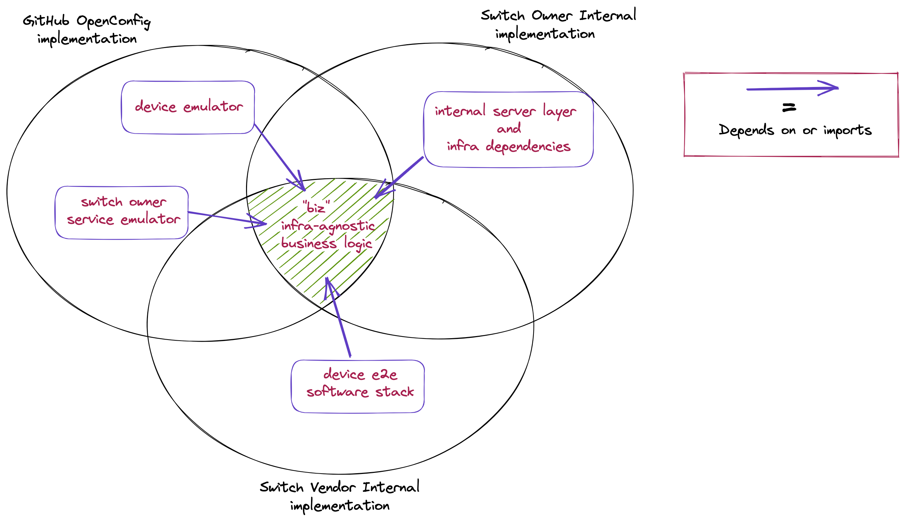
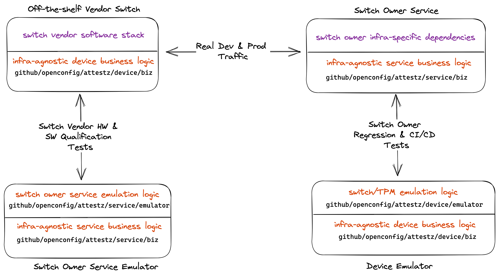

# TPM Enrollment and Attestation of Networking Devices for Device Owners <!-- omit from toc -->

TPM (Trusted Platform Module) enrollment workflow is responsible for cryptographically verifying switches' TPM-rooted identities and provisioning devices with switch owner's attestation and TLS certificates.
TPM attestation workflow ensures the integrity of networking devices throughout the entire boot process. The goal of this repository is to specify TPM enrollment and attestation workflow steps, design/APIs, and suggest a corresponding reference implementation of both switch and switch-owner sides of logic.

## Table of Contents <!-- omit from toc -->

- [Terminology](#terminology)
- [Design](#design)
  - [TPM 2.0 Enrollment for Switch Owners](#tpm-20-enrollment-for-switch-owners)
    - [TPM 2.0 Enrollment using Vendor-issued Certificates](#tpm-20-enrollment-using-vendor-issued-certificates)
      - [TPM 2.0 Enrollment Workflow Steps (Vendor-issued Certificates)](#tpm-20-enrollment-workflow-steps-vendor-issued-certificates)
      - [TPM 2.0 Enrollment using Vendor-issued Certificates Workflow Diagram](#tpm-20-enrollment-using-vendor-issued-certificates-workflow-diagram)
    - [TPM 2.0 Enrollment via HMAC challenge](#tpm-20-enrollment-via-hmac-challenge)
      - [TPM 2.0 Enrollment Workflow Steps (HMAC Challenge)](#tpm-20-enrollment-workflow-steps-hmac-challenge)
      - [TPM 2.0 Enrollment via HMAC Challenge Workflow Diagram](#tpm-20-enrollment-via-hmac-challenge-workflow-diagram)
    - [TPM 2.0 Enrollment Alternatives Considered](#tpm-20-enrollment-alternatives-considered)
      - [1. EnrollZ service serves TPM enrollment API endpoints](#1-enrollz-service-serves-tpm-enrollment-api-endpoints)
      - [2. Use IAK cert (as is) signed by the switch vendor CA](#2-use-iak-cert-as-is-signed-by-the-switch-vendor-ca)
      - [3. Switch owner uses EK (or EK cert) to issue LAK cert](#3-switch-owner-uses-ek-or-ek-cert-to-issue-lak-cert)
      - [4. Switch owner issues LAK cert based on IAK cert signed by switch vendor CA](#4-switch-owner-issues-lak-cert-based-on-iak-cert-signed-by-switch-vendor-ca)
  - [TPM 2.0 Attestation for Switch Owners](#tpm-20-attestation-for-switch-owners)
    - [General Guidelines on What to Attest](#general-guidelines-on-what-to-attest)
    - [Conceptual Flow for _Offline_ PCR Value Precomputation](#conceptual-flow-for-offline-pcr-value-precomputation)
    - [TPM 2.0 Attestation Workflow Steps](#tpm-20-attestation-workflow-steps)
    - [TPM 2.0 Attestation Workflow Diagram](#tpm-20-attestation-workflow-diagram)
    - [TPM 2.0 Attestation Alternatives Considered](#tpm-20-attestation-alternatives-considered)
  - [Special Considerations](#special-considerations)
    - [Switch Owner Prod TLS Cert Issuance](#switch-owner-prod-tls-cert-issuance)
    - [RMA Scenario](#rma-scenario)
- [Implementation](#implementation)
  - [Code Structure](#code-structure)
  - [Use Cases for Various Packages](#use-cases-for-various-packages)
  - [Handy Commands](#handy-commands)

## Terminology

- [Bootz](https://github.com/openconfig/bootz) is an evolution of [sZTP](https://www.rfc-editor.org/rfc/rfc8572.html).
- TPM EnrollZ service (or simply EnrollZ service) is the switch owner's internal infrastructure service responsible for the TPM 2.0 enrollment workflow.
- TPM AttestZ service (or simply AttestZ service) is switch owner's internal infrastructure service responsible for TPM 2.0 attestation workflow.
- Switch owner CA is the switch owner's internal Certificate Authority service.
- Switch chassis consists of one or more _“control cards”_ (or _“control cards”_, _“routing engines”_, _“routing processors”_, etc.), each of which is equipped with its own CPU and TPM. The term control card will be used throughout the doc.

**Differences between various certs** _(more details in the [TCG spec](https://trustedcomputinggroup.org/wp-content/uploads/TPM-2p0-Keys-for-Device-Identity-and-Attestation_v1_r12_pub10082021.pdf))_:

|          **Cert type**           | **On which pub key is the cert based on?** | **Can there be more than one underlying keypair for a given TPM?** | **Which CA issues/signs the cert?** |
| :------------------------------: | :----------------------------------------: | :----------------------------------------------------------------: | :---------------------------------: |
|  Initial Attestation Key (IAK)   |                  IAK pub                   |                                 No                                 |            Switch Vendor            |
|   Local Attestation Key (LAK)    |                  LAK pub                   |                                Yes                                 |            Switch Owner             |
|         Owner IAK (oIAK)         |                  IAK pub                   |                                 No                                 |            Switch Owner             |
| Initial Device Identity (IDevID) |                 IDevID pub                 |                                 No                                 |            Switch Vendor            |
|  Local Device Identity (LDevID)  |                 LDevID pub                 |                                Yes                                 |            Switch Owner             |
| Owner Device Identity (oIDevID)  |                 IDevID pub                 |                                 No                                 |            Switch Owner             |
|       Endorsement Key (EK)       |                   EK pub                   |                                 No                                 |             TPM Vendor              |

## Design

### TPM 2.0 Enrollment for Switch Owners

There are two primary enrollment flows for switch owners, depending on whether tracked TPM keys (such as EK) and vendor-issued certificates for these keys (such as or IDevID) are present on the device.

1. Vendor-issued Certificates Flow: This flow leverages mutual authentication at the mTLS layer using certificates already provisioned by the vendor. This makes the flow less cryptographically heavy. However, it has a manufacturing dependency, requiring the device to be shipped with valid Initial Attestation Key (IAK) and Initial Device Identity (IDevID) certificates signed by the vendor CA.
2. HMAC Challenge Flow: This flow is used when a device does not have vendor-provisioned identity certificates.
   It establishes trust by verifying a chain of trust originating from the device's Endorsement Key (EK).
   While more cryptographically involved, it removes the dependency on the vendor CA for identity certificates,
   instead requiring the switch owner to maintain a trusted database of EK public keys fetched from the vendor's Ownership Voucher gRPC Service (OVGS).

#### TPM 2.0 Enrollment using Vendor-issued Certificates

In this workflow switch owner verifies device's Initial Attestation Key (IAK) and Initial DevID (IDevID) certificates (signed by the switch vendor CA) and installs/rotates owner IAK (oIAK) and owner IDevID (oIDevID) certificates (signed by switch owner CA). oIAK and oIDevID certs are based on the same underlying keys as IAK and IDevID certs, respectively, and give switch owner the ability to (1)
fully control certificate structure, revocation and expiration policies and (2) remove external dependency on switch vendor CA during TPM attestation workflow. The assumption is that before the device is shipped to the switch owner, a switch vendor provisions each control card with IAK and IDevID certificates following the TCG specification in
[Section 5.2](https://trustedcomputinggroup.org/wp-content/uploads/TPM-2p0-Keys-for-Device-Identity-and-Attestation_v1_r12_pub10082021.pdf#page=20) and [Section 6.2](https://trustedcomputinggroup.org/wp-content/uploads/TPM-2p0-Keys-for-Device-Identity-and-Attestation_v1_r12_pub10082021.pdf#page=30).

The latest [TCG spec](https://trustedcomputinggroup.org/wp-content/uploads/PC-Client-Specific-Platform-TPM-Profile-for-TPM-2p0-v1p05p_r14_pub.pdf) makes it mandatory to support ECC P384, RSA 3072 and SHA 384, while ECC P521, RSA 4096 and SHA 512 are optional.
Even though it is strongly preferred to rely on ECC P521 and SHA-512 where possible, switch vendors must at the very least support:

1. ECC P384 for EK, IAK and IDevID key pairs.
2. SHA 384 for PCR hash bank (specified as `hash_algo` in `AttestRequest`).
3. SHA 384 for PCR quote digest (part of signature scheme of the IAK key used in [TPM2_Quote()](https://www.trustedcomputinggroup.org/wp-content/uploads/TPM-Rev-2.0-Part-2-Structures-01.38.pdf#page=123)).
4. ECC P384 for switch vendor CA (IAK and IDevID) certificate-signing keys.

##### TPM 2.0 Enrollment Workflow Steps (Vendor-issued Certificates)

1. On completion of Bootz workflow, device obtains all necessary credentials and configurations to start serving TPM enrollment gRPC API endpoints on the same port as gNOI/gNSI/gNMI (9339).
   - _Note: A device is shipped to the switch owner with a default SSL profile configured to rely on the IDevID key pair and IDevID TLS cert (signed by the switch vendor CA) for all RPCs._
2. On completion of Bootz, EnrollZ service is notified to enroll a TPM on a specific control card and calls the device's `GetIakCert` API to get back an IAK and IDevID certs.
   - During initial bootstrapping, an active control card must use its IDevID cert (part of switch's default SSL profile) for securing TLS connection. Once the device is provisioned with switch-owner-issued prod TLS cert in `certz` workflow, the device must always use that cert for all subsequent enrollz RPCs (such as `RotateOIakCert`).
   - Primary/active control card is also responsible for all RPCs directed to the secondary/standby control card. The mechanism of internal communication between the two control cards depends on the switch vendor and is out of scope of this doc.
     Since the switch owner cannot directly TLS authenticate standby card, it is the responsibility of an active card to do an auth handshake with the standby card based on the IDevID key pair/cert as described in [RMA Scenario](#rma-scenario).
3. EnrollZ service uses the trust bundle/anchor obtained (in advance) from the switch vendor to verify signature over the IAK cert, and ensure that the control card serial number in IAK cert and IDevID cert is the same.
   - _Note: EnrollZ service must have access to the up-to-date switch vendor trust bundle/anchor needed to verify the signature over the IAK and IDevID certificates. The mechanics of this workflow are out of scope of this doc, but the trust bundle could be retrieved from a trusted vendor portal on a scheduled basis._
4. EnrollZ service ensures that device identity fields in IAK and IDevID certs match its expectations.
5. EnrollZ service asks switch owner CA to issue an oIAK and oIDevID certs based on the IAK and IDevID pub keys, respectively.
6. EnrollZ service obtains the oIAK and oIDevID certs from the CA and calls the device's `RotateOIakCert` API to persist the oIAK and oIDevID certs on the control card.
7. The switch verifies that the IAK pub key in oIAK cert matches the one in IAK cert and that IDevID pub key in oIDevID cert matches the one in IDevID cert.
8. The switch stores oIAK and oIDevID certs in non-volatile memory and will present them in the TPM attestation `attestz` workflow.
9. The switch must use the profile created during bootz which provided the trust bundle. This will rotate the profiles cert to be the provided Owner IDevID cert and
   sets the Owner IAK cert.
   - _Note: This implies that after successful enrollment the switch must force all its gRPC servers/services (such as `attestz` and `certz`) to respect the updated SSL profile relying on oIDevID cert. This should have already been set as part of bootz but this should again be forced at part of enrollment_
     _Note: Further Rotate calls may only require the rotation of the Owner IAK cert so those messages
     will not contain the `ssl_profile_id` nor `oidevid_cert` fields._
10. EnrollZ service repeats the workflow for the second control card if one is available.

**Pros:**

- The approach effectively delegates much of the TPM enrollment workflow to the switch vendor which aligns with the TCG guidance/intention.
- Simplicity of TPM enrollment workflow on switch owner side which should streamline the implementation of the workflow for both switch owner and switch vendors and thus make it easier to onboard new and scale across vendors.
- Using oIAK and oIDevID certs gives switch owners more flexibility and control over the cert structure, management (e.g. revocation) and lifecycle.
- AttestZ service does not have an external dependency on switch vendor CA on every switch attestation.
- Switch vendors do not need to support issuance of LAKs.

**Cons:**

- Need to trust that switch vendors actually performed proper TPM enrollment following TCG spec.

##### TPM 2.0 Enrollment using Vendor-issued Certificates Workflow Diagram



#### TPM 2.0 Enrollment via HMAC challenge

This enrollment flow is used for TPM 2.0 devices where the switch owner has access to the device's Endorsement Key (EK) public key or certificate, but the device does not have a vendor-provisioned IDevID or IAK certificate.
This flow establishes trust in device-generated IAK and IDevID keys by verifying a chain of trust originating from the EK, whose authenticity is confirmed via proof-of-possession using an HMAC-based challenge.
This approach eliminates the requirement for vendors to provision IAK/IDevID certificates during manufacturing and offers a universal solution for any TPM 2.0 device, provided the EK public keys or certificates are tracked by the owner.

Prerequisites:

- The vendor must record the EK public key or certificate and provide it for each supervisor via the Ownership Voucher gRPC Service (OVGS) along with other identifiers such as serial number, mac address and hardware model.
- The switch owner must maintain a trusted, secure database called Root of Trust (RoT) database, that fetches vendor EKs from the vendor's Ownership Voucher gRPC Service (OVGS) and stores them. The EKs should be queryable via the supervisor serial number returned from the device.

##### TPM 2.0 Enrollment Workflow Steps (HMAC Challenge)

1. On completion of Bootz workflow, device obtains all necessary credentials and configurations to start serving TPM enrollment gRPC API endpoints.
2. EnrollZ service is notified to enroll a TPM on a specific device. It establishes a one-way TLS connection where the device is required to verify the certs presented by EnrollZ service via the trust bundle provided in Bootz, and the device is not required to present a certificate.
3. EnrollZ calls device's `GetControlCardVendorID` to get card details like serial number.
4. EnrollZ queries its Root of Trust (RoT) database using serial number to fetch device's EK public key.
5. EnrollZ creates a restricted HMAC key, wraps it to the EK public key, and sends `Challenge` RPC to device with wrapped HMAC key and other details.
6. Device imports HMAC key using its EK private key, creates an IAK key pair if one doesn't exist, and calls `TPM2_Certify` to certify IAK public key using imported HMAC key.
7. Device returns IAK public key, `iak_certify_info` structure, and `iak_certify_info_signature` as part of `ChallengeResponse`.
8. EnrollZ verifies `iak_certify_info_signature` using HMAC key it generated. It also verifies `iak_certify_info` to confirm that IAK is a legitimate TPM-resident key held by same TPM that holds EK private key. EnrollZ also verifies IAK public area attributes.
9. EnrollZ calls device's `GetIdevidCsr` RPC, requesting IDevID CSR with a specific key template. Note: Currently the only supported template is [Template H-3: ECC NIST P384](https://trustedcomputinggroup.org/wp-content/uploads/TPM-2p0-Keys-for-Device-Identity-and-Attestation_v1_r12_pub10082021.pdf#page=44).
10. Device returns `GetIdevidCsrResponse` containing `csr_contents` and `idevid_signature_csr`. `csr_contents` contains IDevID public area, IAK public area, IDevID certification data and its signature by IAK.
11. EnrollZ uses IAK public key (verified in step 7) to validate signature on IDevID certification data within `csr_contents`.
12. EnrollZ verifies the IDevID certification data to confirm that IDevID is a legitimate TPM-resident key held by same TPM that holds IAK private key and verifies IDevID public area attributes against key template.
13. EnrollZ uses IDevID public key to verify `idevid_signature_csr`.
14. EnrollZ service repeats steps 3-12 for each control card.
15. Once all control cards are verified, EnrollZ asks switch owner CA to issue oIAK and oIDevID certs for all control cards based on their IAK and IDevID pub keys.
16. EnrollZ service obtains all oIAK and oIDevID certs from CA and calls device's `RotateOIakCert` API once with all certs to be persisted on all control cards.
17. The switch verifies that the pub keys in oIAK and oIDevID certs match its IAK and IDevID pub keys for each control card, and stores certs in non-volatile memory for `attestz` workflow.

##### TPM 2.0 Enrollment via HMAC Challenge Workflow Diagram



#### TPM 2.0 Enrollment Alternatives Considered

##### 1. EnrollZ service serves TPM enrollment API endpoints

**Pros:**

- A device knows exactly when it is ready to kick off TPM enrollment workflow (right after Bootz workflow and potential subsequent reboot are complete) whereas in the proposed workflow EnrollZ service will likely need to repeatedly try to reach out to the device until it is ready for TPM enrollment.
- Can be achieved with a single `ExchangeIakCert` API: given an IAK cert return an oIAK cert.

**Cons:**

- From a security standpoint, switches generally should not be initiating connections.
- The design will be cleaner if TPM enrollment followed the same pattern as TPM attestation and gNxI APIs where the device serves the endpoints.

##### 2. Use IAK cert (as is) signed by the switch vendor CA

The workflow would follow the TCG specification documented in [section 5.1](https://trustedcomputinggroup.org/wp-content/uploads/TPM-2p0-Keys-for-Device-Identity-and-Attestation_v1_r12_pub10082021.pdf#page=19) and [section 6.1](https://trustedcomputinggroup.org/wp-content/uploads/TPM-2p0-Keys-for-Device-Identity-and-Attestation_v1_r12_pub10082021.pdf#page=27).

**Pros:**

- Simplifies the workflow and practically removes the TPM enrollment workflow on the switch owner side.

**Cons:**

- Introduces a strong runtime dependency on switch vendor CA every time AttestZ service performs TPM attestation.
- Using a switch-vendor-issued IAK cert gives the switch owner no control over the cert structure, management (e.g. revocation) and lifecycle.
- Need to trust that the switch vendor actually performed proper TPM enrollment following TCG spec.

##### 3. Switch owner uses EK (or EK cert) to issue LAK cert

The workflow would follow the TCG specification documented in [section 5.6](https://trustedcomputinggroup.org/wp-content/uploads/TPM-2p0-Keys-for-Device-Identity-and-Attestation_v1_r12_pub10082021.pdf#page=24) and [section 6.6](https://trustedcomputinggroup.org/wp-content/uploads/TPM-2p0-Keys-for-Device-Identity-and-Attestation_v1_r12_pub10082021.pdf#page=34). In this case the switch vendor would
not perform TPM enrollment at all.

**Pros:**

- Using LAK gives switch owners more flexibility and control over the cert structure, management (e.g. revocation) and lifecycle.
- No need to trust that the switch vendor actually performed proper TPM enrollment following TCG spec.
- Switch vendors do not need to do TPM enrollment and provision the switch with an IAK.
- AttestZ service does not have an external dependency on switch vendor CA on every switch attestation.

**Cons:**

- Switch owner has to develop and support complex TPM enrollment logic that verifies that the device indeed possesses EK private key.
- Either (1) all switch vendors have to publish EK pub on their portal and switch owner to build an automatic system (for each vendor) to fetch and persist it in advance of device shipment or (2) switch owner to obtain and manage a TPM manufacturer trust bundle to verify EK cert with which all switches must be provisioned.
- Switch vendors need to support issuance of LAKs.
- LAKs are also primarily used in scenarios where device/user privacy is important. In the case of network switches (especially the ones running in switch owner's own data centers), however, infra components would actually want to know exactly the identities of the switches, so their privacy is not desirable. Consult
  [section 11](https://trustedcomputinggroup.org/wp-content/uploads/TPM-2p0-Keys-for-Device-Identity-and-Attestation_v1_r12_pub10082021.pdf#page=64) of the TCG spec for more details.

##### 4. Switch owner issues LAK cert based on IAK cert signed by switch vendor CA

The workflow would follow the TCG specification documented in [section 5.3](https://trustedcomputinggroup.org/wp-content/uploads/TPM-2p0-Keys-for-Device-Identity-and-Attestation_v1_r12_pub10082021.pdf#page=21) and [section 6.3](https://trustedcomputinggroup.org/wp-content/uploads/TPM-2p0-Keys-for-Device-Identity-and-Attestation_v1_r12_pub10082021.pdf#page=32).

**Pros:**

- Using LAK gives switch owners more flexibility and control over the cert structure, management (e.g. revocation) and lifecycle.
- AttestZ service (a performance-critical service) does not have an external dependency on switch vendor CA on every switch attestation.

**Cons:**

- Need to trust that the switch vendor actually performed proper TPM enrollment following TCG spec.
- The most expensive approach in terms of software development/maintenance perspective as both switch vendors and switch owners will need to engineer complex TPM enrollment logic (see TCG spec for more details).
- Switch vendors need to support issuance of LAKs.
- LAKs are also primarily used in scenarios where device/user privacy is important. In the case of network switches (especially the ones running in switch owner's own data centers), however, infra components would actually want to know exactly the identities of the switches, so their privacy is not desirable. Consult
  [section 11](https://trustedcomputinggroup.org/wp-content/uploads/TPM-2p0-Keys-for-Device-Identity-and-Attestation_v1_r12_pub10082021.pdf#page=64) of the TCG spec for more details.

### TPM 2.0 Attestation for Switch Owners

In this workflow switch owner verifies that the device's end-to-end boot state (bootloader, OS, secure boot policy, etc.) matches owner's expectations. This approach assumes that expected final PCR values were precomputed beforehand and are available during the attestation workflow. Thus, on a high level for each control card AttestZ service will (1) fetch final observed PCR values, PCR quote
(signed with IAK private key) and oIAK cert from the device, (2) verify oIAK cert, (3) verify PCR quote signature with oIAK cert, (4) verify PCRs digest, (5) compare observed PCR final values to the expected ones.

#### General Guidelines on What to Attest

This section is out of scope of the broader openconfig initiative and instead serves more as a guideline. The general question one should ask when thinking of what to attest is "does changing X on the device change the fundamental boot posture of the device?".
If the answer is yes, then attest it, otherwise it is not required. The recommended scope of attestation measurements is from the first instruction up to and including rootfs. That is, the scope for attestation covers the static boot process up to and including the root filesystem (rootfs), excluding runtime.
Device attestation relies on building a chain of trust. The trust in the measurements of higher layers of the boot chain is dependent on the successful verification and established trust of each preceding stage, starting from the initial instruction. This sequential verification process ensures a chain of trust from the hardware Root of Trust (RoT) up to the static root filesystem.
Based on this approach, the measurements required to validate device integrity are:

- **Boot Chain Coverage**: The measurements must cover the entire boot process, from the initial hardware boot stages up to the static operating system.
- **Filesystem Integrity**: The measurements include critical parts of the root filesystem. In general, we require a static root filesystem to be covered.
- **Security Configuration**: Secure boot configuration and policies are included in the measurements, while runtime data is excluded.

Similarly, TCG discourages attesting device-specific configurations/software or things that may change after a reboot. In section [3.3.4.2](https://trustedcomputinggroup.org/wp-content/uploads/TCG_PCClient_PFP_r1p05_v23_pub.pdf#page=40) and 3.3.4.4 for PCR [1] and PCR[3] (both of which measure configuration related data) TCG spec states:
_"Entities that MUST NOT be measured as part of the above measurements: System-unique information such as asset, serial numbers, etc., as they would prevent sealing to PCR[3] with a common configuration in a fleet of devices"_ and _"The event data MUST not vary across boot cycles if the set of potential PCR[1] measurements measured does not vary"_.
Instead of attesting such configurations, it should be software's (e.g. OS or application layer) responsibility to verify/validate such configs, while the switch owner may attest the underlying software image containing the verification logic.

Attesting secrets is an antipattern. Even if one is attesting password _hashes_ and even if a hash has strong entropy, it is still a good practice to avoid attesting secrets or potentially-secrets-revealing data.
This is mainly because all the attestable measurements are considered to be public and are logged in plain into the bootlog, which is intended (although not required) to be publicly shared during attestation.

Finally, although the exact PCR allocation may vary across vendors, the expectation is that switch vendors will follow standardized [TCG guidance](https://trustedcomputinggroup.org/wp-content/uploads/TCG_PCClient_PFP_r1p05_v23_pub.pdf#page=36) (which measurements are measured in which PCRs, who makes those measurements, the order of measurements, etc.) for these measurements:

| **PCR Index** | **PCR Usage**                                                                                       |
| :------------ | :-------------------------------------------------------------------------------------------------- |
| 0             | SRTM, BIOS, Host Platform Extensions, Embedded Option ROMs and PI Drivers                           |
| 1             | Host Platform Configuration                                                                         |
| 2             | UEFI driver and application Code                                                                    |
| 3             | UEFI driver and application Configuration and Data                                                  |
| 4             | UEFI Boot Manager Code (usually the MBR) and Boot Attempts                                          |
| 5             | Boot Manager Code Configuration and Data (for use by the Boot Manager Code) and GPT/Partition Table |
| 6             | Host Platform Manufacturer Specific                                                                 |
| 7             | Secure Boot Policy                                                                                  |
| 8-15          | Defined for use by the Static OS                                                                    |
| 16            | Debug                                                                                               |
| 23            | Application Support                                                                                 |

#### Conceptual Flow for _Offline_ PCR Value Precomputation

The core concept of offline precomputation is to optimize the attestation process by utilizing final expected PCR values provided by the vendor. Instead of recomputing expected PCR values from the boot log for every attestation, the AttestZ service compares the PCR values reported by the device against pre-ingested, expected values.
This applies specifically to PCRs that are consistent across a given product model and software version (e.g., BIOS image, bootloader image, OS image, and secure boot policy).

To implement this workflow effectively, the following operational aspects are considered:

- **Reference Value Acquisition Method**: Expected PCR values are primarily provided by the device vendor. The ideal and expected method is for these values to be delivered via a secure mechanism, such as an API endpoint or by being included within the firmware/software image bundle using the structured, cryptographically signed format defined by OpenConfig.
- **Timing**: The reference values are typically acquired or updated whenever a new software/firmware image version is qualified.
- **Staging Phase**: Once acquired, the reference values are ingested and stored in a dedicated internal database. This system acts as the central source of truth for the reference measurements during the verification process.

#### TPM 2.0 Attestation Workflow Steps

1. Device serves gRPC TPM 2.0 attestation endpoints on the same port as gNOI/gNSI/gNMI (9339). At this point the device must be booted with the correct OS image and with correct configurations/credentials applied.
   - Primary/active control card is also responsible for all RPCs directed to the secondary/standby control card. The mechanism of internal communication between the two control cards depends on the switch vendor and is out of scope of this doc.
     Since the switch owner cannot directly TLS authenticate standby card, it is the responsibility of an active card to do an auth handshake with the standby card based on the IDevID key pair/cert as described in [RMA Scenario](#rma-scenario).
   - Device uses active control card’s IDevID private key and oIDevID cert for securing TLS for the **initial** attestation RPCs. On successful completion of initial attestation, the device will be provisioned with switch owner’s prod credentials/certs and will rely on those for securing TLS in subsequent attestation workflows.
2. AttestZ service calls device’s `Attest` endpoint for a given control card (and a random nonce) to get back:
   - An oIAK cert (received by the device during the TPM enrollment workflow) signed by the switch owner’s CA.
   - Final observed PCR hashes/values.
   - PCR Quote structure and signature over it signed by IAK private key.
   - (Optional - only when the call is intended for the standby control card) oIDevID cert of the standby control card.
3. AttestZ service uses the trust bundle/anchor from switch owner CA to verify oIAK cert and its validity/revocations status.
4. AttestZ service verifies that the control card serial number in oIAK cert and oIDevID cert is the same.
5. AttestZ service uses oIAK cert to verify signature over device’s PCR quote.
6. AttestZ service recomputes PCR digest and matches it against the one used in PCR quote.
7. AttestZ service fetches expected final PCR values from its DB and compares those to the observed ones reported by the device.
8. AttestZ service records a successful attestation status for a given control card and repeats the workflow for the secondary/standby control card if one is available.

**Pros:**

- No dependency on device boot log that needs to be standardized across all switch vendors.
- Attestation logic is simple as it boils down to just comparing final PCR hashes and does not involve PCR recomputation from the boot log.
- Expected final PCR values are computed only once, for all devices and offline (before devices arrive to switch owners as opposed to on every attestation while switches are already serving production traffic). This is both efficiency and reliability gain.
- The design can be extended to attest device-specific PCRs if needed. In this case switch vendors will also provide (along with final expected PCRs) a structured vendor-agnostic PCR measurement manifest object which describes how to calculate final PCRs and at the very least specifies (1) what measurements go into which PCR, (2) the order of measurements, (3) cryptographic hash algorithm used.
  - _Note: For the actual manifest structure definition, we should consider getting ideas from the [attestation log-retrieval API](https://datatracker.ietf.org/doc/pdf/draft-ietf-rats-yang-tpm-charra-21#page=6) by IETF ChaRRA and reusing/expanding the design from the [Reference Integrity Manifest](https://trustedcomputinggroup.org/wp-content/uploads/TCG_RIM_Model_v1p01_r0p16_pub.pdf) by TCG.
    The goal is for a switch owner, given a vendor-agnostic PCR measurement manifest (the API/object/format definition is vendor-agnostic, but the actual instance of that object is vendor-specific) and PCR measurement inputs (e.g. boot configuration), to have the ability to pre-calculate the expected final PCRs for a given device using standard TPM folding hash technique. For example:_

        ```text
        PCR[5]  ← 0
        PCR[5]  ← Hash(PCR[5] || sha-256(“config-Y”))
        PCR[5]  ← Hash(PCR[5] || sha-256(“config-Z”))
        ```

**Cons:**

- Pre-computation approach deviates from the general TCG specification and IETF ChaRRA draft.

Once the attestation workflow is complete for both control cards, AttestZ service will provision the device with mTLS credentials/certs. Although this workflow is out of scope of this doc, on a high level it may look like this:

1. AttestZ service completes attestation workflow for all switch chassis control cards.
2. AttestZ service asks the device to generate and send back a standard signed OpenSSL Certificate Signing Request (CSR) for issuance of the mTLS credential/cert.
   - _Note: in future, we can further improve the security posture of switches by sealing the private key to the TPM state. This would ensure that a device (1) has to have certain PCR final values to be able to access (unseal) the credential and (2) that only the intended device/control card can access the credential._
3. AttestZ service verifies CSR and sends the request to issue a mTLS cert to switch owner CA.
4. AttestZ service calls the device to persist the mTLS cert.
5. The device ensures that the cert pub key matches the one it created earlier and persists the cert in non-volatile memory.

#### TPM 2.0 Attestation Workflow Diagram



#### TPM 2.0 Attestation Alternatives Considered

Before the device is shipped to the switch owner, the switch owner fetches individual PCR measurement artifacts such as bootloader image hash and OS image hash from the switch vendor portal and stores those in the internal DB.

Attestation workflow with differences from the proposed approach in **bold**:

1. Device serves gRPC TPM 2.0 attestation APIs. At this point the device must be booted with the correct OS image and with correct configurations/credentials applied.
   - Primary/active control card is also responsible for all RPCs directed to the secondary/standby control card. The mechanism of internal communication between the two control cards depends on the switch vendor and is out of scope of this doc.
   - Device uses active control card’s IDevID private key and oIDevID cert for securing TLS for the initial attestation RPCs. Once the device successfully completes attestation and is provisioned with switch owner’s prod credentials/certs, the device will rely on those for securing TLS in subsequent attestation workflows.
2. AttestZ service calls device’s `Attest` endpoint for a given control card (and a random nonce) to get back _(note: the API can borrow ideas from [log-retrieval](https://datatracker.ietf.org/doc/pdf/draft-ietf-rats-yang-tpm-charra-21#page=5) and [tpm20-challenge-response-attestation](https://datatracker.ietf.org/doc/pdf/draft-ietf-rats-yang-tpm-charra-21#page=4) APIs):_
   - An oIAK cert signed by the switch owner’s CA and received by the device during the TPM enrollment workflow.
   - Final observed PCR hashes.
   - Quote structure and signature over it signed by IAK private.
   - **Boot log**.
   - (Optional - only when the call is intended for the standby control card) oIDevID cert of the standby control card.
3. AttestZ service uses the trust bundle/anchor from switch owner CA to verify oIAK cert and its validity/revocations status.
4. AttestZ service verifies that the control card serial number in oIAK cert and oIDevID cert is the same.
5. AttestZ service uses oIAK cert to verify signature over device’s PCR quotes.
6. AttestZ service recomputes PCR digest and matches it against the one used in PCR quote.
7. **AttestZ service recomputes final PCR values from the boot log and compares those to the PCR values that the device’s TPM reported. If those match, it can trust the boot log.**
8. **AttestZ service fetches the hashes of PCR measurement events (e.g. OS image hash, bootloader image hash, etc.) it is interested in from the device’s boot log.**
9. **AttestZ service fetches expected PCR measurement (bootloader image, OS image) hashes from internal DB and compares those to the ones from the device’s boot log.**
10. AttestZ service records a successful attestation status for a given control card.
11. AttestZ service repeats the workflow for the secondary/standby control card if one is available.

**Pros:**

- Switch owners can adapt to changes in PCR measurements (for example, if there is new artifact measured to a given PCR) on the fly.
- Switch vendors do not need to host an API to give the switch owner PCR measurement manifest with every bootloader/OS release.
  - _Note: this is only valid when attestation of device-specific PCRs is needed._
- Aligns with the general TCG specification and IETF ChaRRA draft.

**Cons:**

- AttestZ service has a dependency on device boot log that needs to be standardized across all switch vendors.
- Attestation logic becomes more complex as it involves parsing (hopefully vendor-agnostic) boot log and recomputing all PCRs.
- PCR recomputation from the boot log happens in AttestZ service on every attestation when the switches already serve prod traffic. For most (if not all) of the PCRs the recomputed values should be the same for all devices which is also inefficient.
- AttestZ service needs to “know” the measurement events it is looking for in the log or internal DB. This may not scale well if the events are expected to change over time or if they differ between different switch vendors. Most likely this would imply for switch vendors to provide a simpler version of PCR measurement manifest which defeats the purpose of the approach.

### Special Considerations

#### Switch Owner Prod TLS Cert Issuance

Although TLS cert/keys issuance workflow/APIs is outside of the scope of this document, attestz and enrollz require the following handling of private TLS keys for TPM-equipped networking devices. Each control card has its own separate prod TLS key pair and cert that it never shares with the other card.
Each card can perform CSR-style TLS key pair/cert issuance, where TLS pair key is issued by a control card and the private key never leaves a given control card (never shares the key with another card within the same switch chassis either).
Switch owner will always attest a given control card before issuing a new or rotating an existing prod TLS cert.
In other words, **switch-owner-issued production TLS credentials/certs can only be accessible to control cards that have been TPM enrolled and attested by switch owner**. If a standby control card becomes active/primary, it must use its own TLS cert for all connections with switch owner infra.

#### RMA Scenario

One benefit of having multiple control cards is a redundancy model where one control card (active) is serving traffic while another card is unavailable. In such a scenario a switch owner would typically want to replace the failed control card, while the active card is still serving traffic (aka hot-swapping).
The newly inserted (standby) card must be TPM enrolled and attested by the switch owner before the card gets access to switch-owner-issued prod TLS cert. Thus, conceptually the RMA workflow would be the following:

1. During the initial device secure install, switch owner TPM enrolls and attests both control cards. One of the cards acts as primary, serving prod traffic. Each control card has its own switch-owner-issued TLS cert.
2. One of the cards fails and a new standby card is inserted, while the active card is serving prod traffic.
3. Active control card conducts an auth handshake with a newly inserted control card.
   1. Active card sends a nonce to the new standby card.
   2. Standby card signs the nonce with its IDevID private key and sends it back along with its IDevID cert.
   3. Active card verifies nonce signature and IDevID cert.
4. Active card notifies switch owner infra that a new control card is inserted.
5. Switch owner initiates enrollz and attestz workflow for the new standby card. Once attestz succeeds, switch owner issues to the standby control card its own TLS credentials/cert.

## Implementation

### Code Structure

This diagram describes the expected relationship between OpenConfig OSS, switch vendor and switch owner codebases.



### Use Cases for Various Packages

This diagram highlights various use cases for different packages.



### Handy Commands

    # Completely remove the entire working tree created by a Bazel instance.
    bazel clean --expunge

    # Regenerate Go protobuf and gRPC client/service files.
    sh regenerate-files.sh

    # Build all targets.
    bazel build //...

    # Update Go dependencies in go.mod and go.sum.
    go mod tidy

    # Run a specific test.
    go test -v ./service/biz -run TestVerifyAndParseIakAndIDevIdCerts --alsologtostderr
